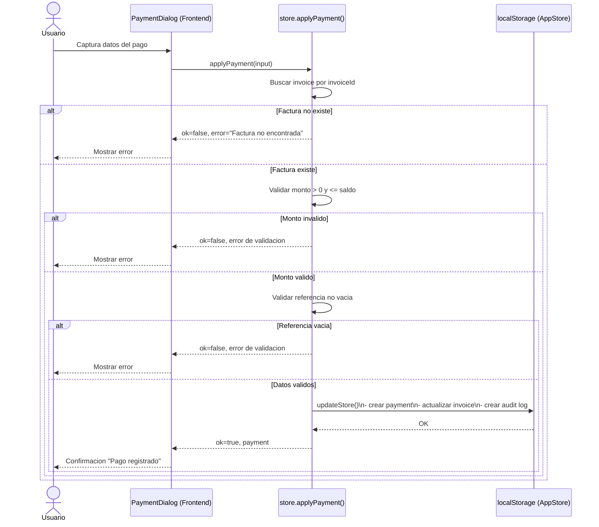
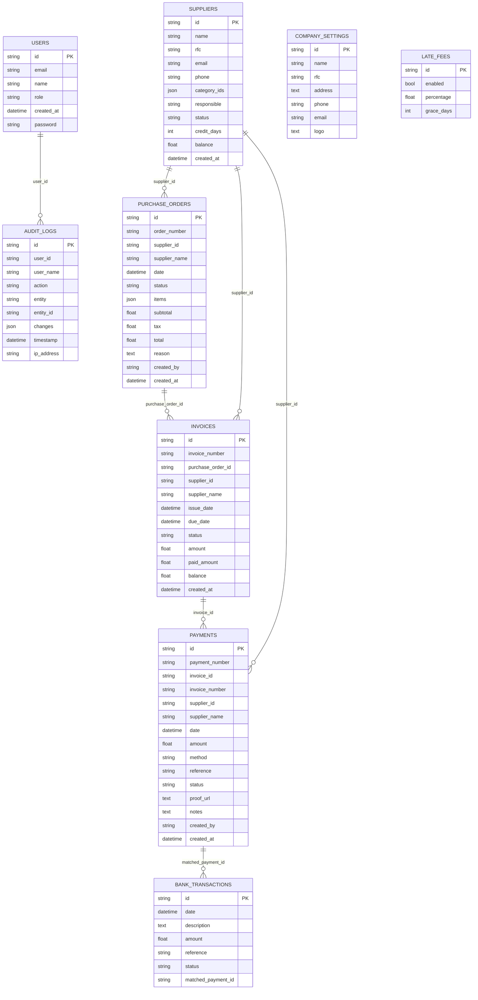
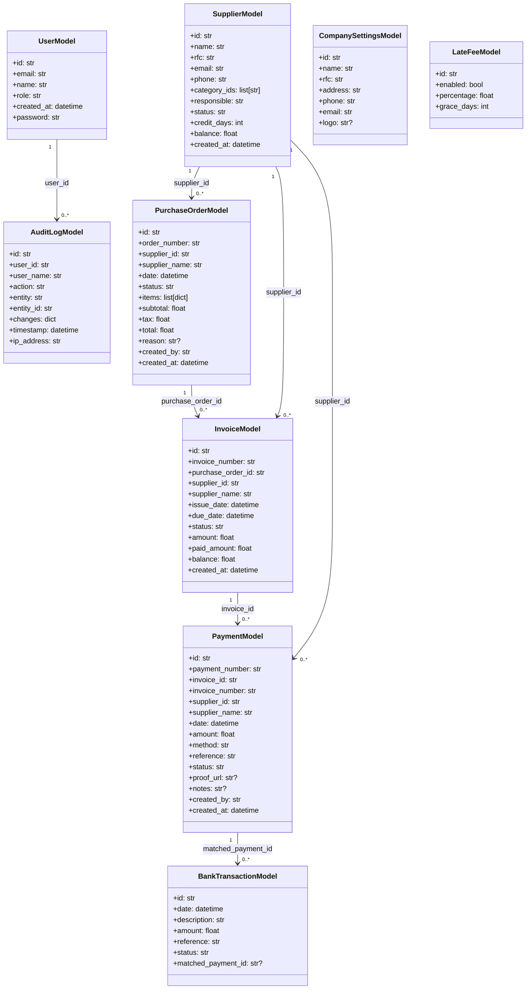

# DIAGRAMS (CURRENT STATE)

These diagrams represent the current implementation in this repository as of 2026-02-10.

## 1. Payment Registration Sequence (Current)

Notes:
- Payment registration currently runs in frontend local state (`lib/store.ts`), not in backend `/payments`.
- Backend route `GET /payments` exists, but payment write endpoints are still pending.

## 2. Backend ER Diagram (Current)

Notes:
- Relationships are logical references by id fields in models.
- The current SQLAlchemy models do not define explicit `ForeignKey(...)` constraints.

## 3. Backend Class Diagram (Current)

Notes:
- These classes mirror `backend/app/models.py`.
- ORM relationship attributes are not declared; links are by ids.
