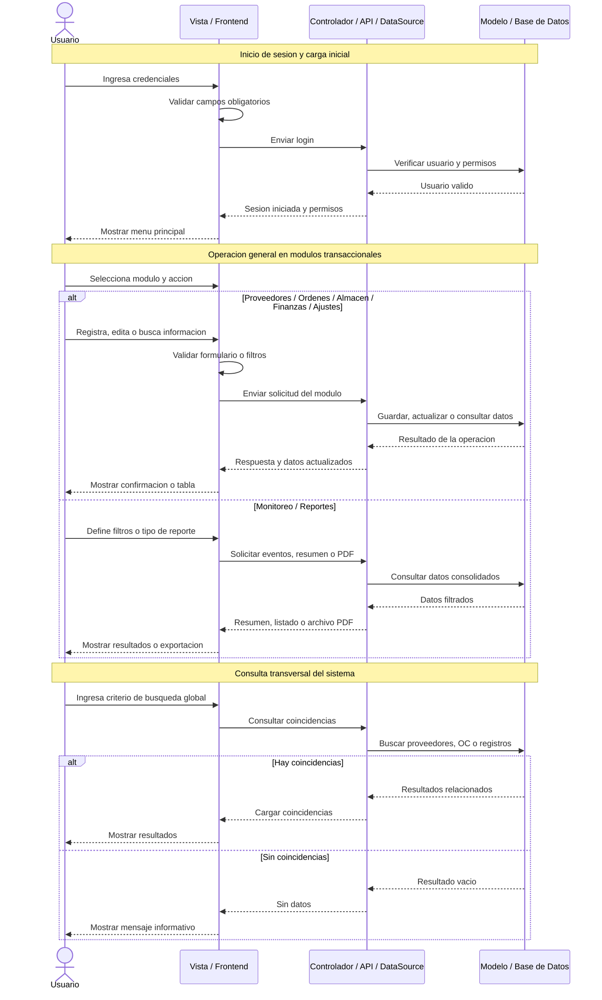
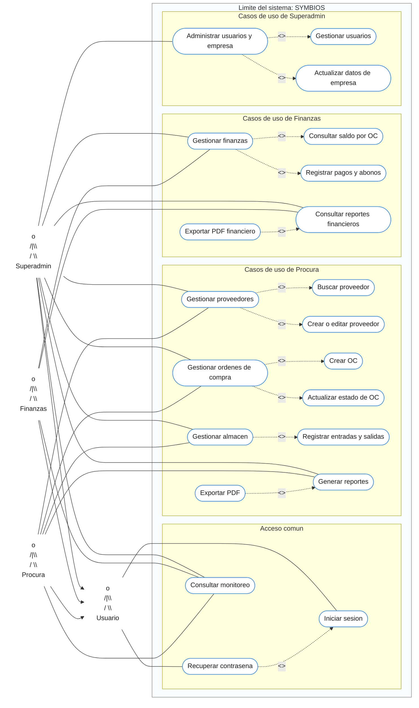
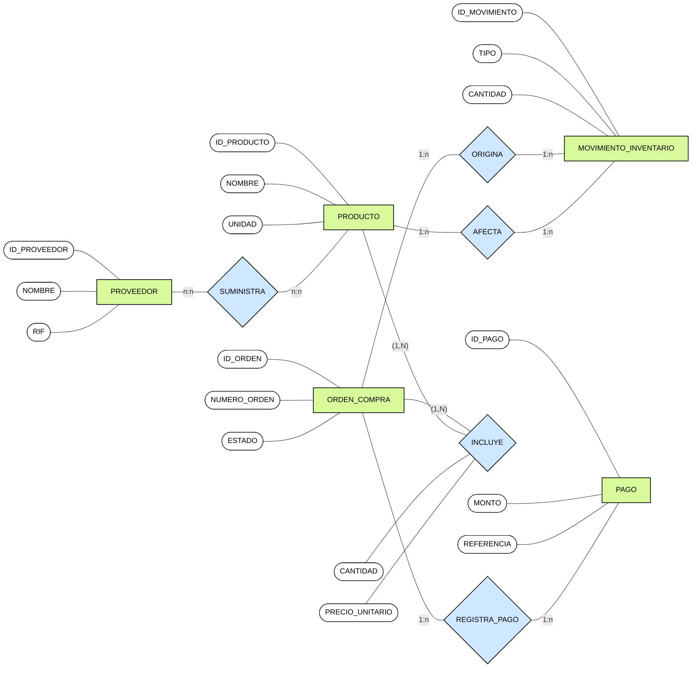

# USER MANUAL

## 1. Objetivo

Este manual explica como usar la app paso a paso para operacion diaria.

## 2. Inicio rapido (primera entrada)

1. Abre la aplicacion (web o escritorio).
2. En la pantalla de login, ingresa un usuario inicial:
   - `juan.perez@empresa.com` / `Admin123!`
   - `maria.lopez@empresa.com` / `Finance123!`
3. Pulsa **Iniciar Sesion**.
4. Verifica que aparezca el modulo de **Monitoreo**.

## 3. Como esta organizada la pantalla

### Menu lateral

- Monitoreo
- Proveedores
- Ordenes de Compra
- Almacen
- Finanzas
- Reportes
- Ajustes

### Barra superior

- Busqueda global (proveedores y OC)
- Notificaciones (OC pendientes y rechazadas)
- Selector de tema
- Indicador de modo de datos: `LOCAL` o `API`
- Menu de usuario (perfil, configuracion, cerrar sesion)

### Diagrama de actividades del menu principal

El siguiente bloque Mermaid adapta el diagrama de referencia a los modulos actuales del proyecto en un formato editable:

```mermaid
flowchart TB
    classDef start fill:#5b9bd5,stroke:#5b9bd5,color:#ffffff,stroke-width:2px;
    classDef action fill:#70ad47,stroke:#548235,color:#ffffff,stroke-width:1px;
    classDef decision fill:#5b9bd5,stroke:#4472c4,color:#ffffff,stroke-width:1px;
    classDef end fill:#a5a5a5,stroke:#7f7f7f,color:#ffffff,stroke-width:2px;
    classDef fork fill:#2f66c8,stroke:#2f66c8,color:#2f66c8,stroke-width:6px;
    linkStyle default stroke:#9dc3e6,stroke-width:1.4px;

    inicio(( )):::start --> login[INICIAR SESION]:::action
    login --> menu[MOSTRAR MENU]:::action

    subgraph barra[" "]
        direction LR
        f1[" "]:::fork --- f2[" "]:::fork --- f3[" "]:::fork --- f4[" "]:::fork --- f5[" "]:::fork --- f6[" "]:::fork --- f7[" "]:::fork
    end
    style barra fill:transparent,stroke:transparent

    menu --> f4

    subgraph col1[" "]
        direction TB
        monitoreo[MONITOREO]:::action --> monitoreo_buscar[Consultar movimientos]:::action --> monitoreo_dec{Hay eventos?}:::decision
        monitoreo_dec -- "Si" --> monitoreo_form[Mostrar eventos]:::action --> monitoreo_revisar[Revisar alertas]:::action
        monitoreo_dec -- "No" --> monitoreo_filtros[Ajustar filtros]:::action
    end

    subgraph col2[" "]
        direction TB
        proveedores[PROVEEDORES]:::action --> proveedores_buscar[Buscar proveedor]:::action --> proveedores_dec{Existe?}:::decision
        proveedores_dec -- "Si" --> proveedores_form[Mostrar en formulario]:::action --> proveedores_actualizar[Actualizar proveedor]:::action
        proveedores_dec -- "No" --> proveedores_crear[Crear proveedor]:::action
    end

    subgraph col3[" "]
        direction TB
        ordenes[ORDENES DE COMPRA]:::action --> ordenes_buscar[Buscar orden]:::action --> ordenes_dec{Existe?}:::decision
        ordenes_dec -- "Si" --> ordenes_form[Mostrar detalle]:::action --> ordenes_actualizar[Actualizar estado de OC]:::action
        ordenes_dec -- "No" --> ordenes_crear[Crear OC]:::action
    end

    subgraph col4[" "]
        direction TB
        almacen[ALMACEN]:::action --> almacen_buscar[Buscar item]:::action --> almacen_dec{Existe?}:::decision
        almacen_dec -- "Si" --> almacen_form[Mostrar stock]:::action --> almacen_mov[Registrar entrada o salida]:::action
        almacen_dec -- "No" --> almacen_entrada[Registrar primera entrada]:::action
    end

    subgraph col5[" "]
        direction TB
        finanzas[FINANZAS]:::action --> finanzas_buscar[Buscar registro]:::action --> finanzas_dec{Existe?}:::decision
        finanzas_dec -- "Si" --> finanzas_form[Mostrar resumen]:::action --> finanzas_pago[Registrar pago o abono]:::action
        finanzas_dec -- "No" --> finanzas_primer[Registrar primer pago]:::action
    end

    subgraph col6[" "]
        direction TB
        reportes[REPORTES]:::action --> reportes_buscar[Buscar reporte]:::action --> reportes_dec{Hay datos?}:::decision
        reportes_dec -- "Si" --> reportes_form[Mostrar vista previa]:::action --> reportes_pdf[Exportar PDF]:::action
        reportes_dec -- "No" --> reportes_param[Ajustar parametros]:::action
    end

    subgraph col7[" "]
        direction TB
        ajustes[AJUSTES]:::action --> ajustes_buscar[Buscar configuracion]:::action --> ajustes_dec{Existe?}:::decision
        ajustes_dec -- "Si" --> ajustes_form[Mostrar en formulario]:::action --> ajustes_actualizar[Actualizar configuracion]:::action
        ajustes_dec -- "No" --> ajustes_crear[Registrar usuario o empresa]:::action
    end

    style col1 fill:transparent,stroke:transparent
    style col2 fill:transparent,stroke:transparent
    style col3 fill:transparent,stroke:transparent
    style col4 fill:transparent,stroke:transparent
    style col5 fill:transparent,stroke:transparent
    style col6 fill:transparent,stroke:transparent
    style col7 fill:transparent,stroke:transparent

    f1 --> monitoreo
    f2 --> proveedores
    f3 --> ordenes
    f4 --> almacen
    f5 --> finanzas
    f6 --> reportes
    f7 --> ajustes

    monitoreo_revisar --> fin((FIN)):::end
    monitoreo_filtros --> fin
    proveedores_actualizar --> fin
    proveedores_crear --> fin
    ordenes_actualizar --> fin
    ordenes_crear --> fin
    almacen_mov --> fin
    almacen_entrada --> fin
    finanzas_pago --> fin
    finanzas_primer --> fin
    reportes_pdf --> fin
    reportes_param --> fin
    ajustes_actualizar --> fin
    ajustes_crear --> fin
```

### Diagrama de secuencia general del sistema

El siguiente bloque Mermaid representa el flujo general del sistema actual, desde el inicio de sesion hasta la gestion de modulos y la consulta de reportes:



### Diagrama de casos de uso general del sistema

El siguiente bloque Mermaid representa los actores, los limites del sistema y los principales casos de uso del proyecto actual:



### Modelo conceptual de la base de datos

El siguiente bloque Mermaid sigue el estilo del ejemplo de diagrama ER conceptual: pocas entidades, atributos alrededor y relaciones centrales basadas en la logica actual del proyecto:



### Diagrama ER general del sistema

El siguiente bloque Mermaid está basado en la base de datos MariaDB actual del proyecto. Incluye todas las tablas existentes en el esquema y representa relaciones lógicas por columnas `*_id`, ya que la base actual no define llaves foráneas físicas:

```mermaid
erDiagram
    USERS {
        string id PK
        string email
        string name
        string role
        datetime created_at
        string password
    }

    SCHEMA_MIGRATIONS {
        string version PK
        string name
        datetime applied_at
    }

    SECURITY_QUESTIONS {
        int id PK
        string question_text
        bool active
    }

    USER_SECURITY_QUESTIONS {
        int id PK
        string user_id FK
        int question_id FK
        string answer_hash
        datetime created_at
    }

    PASSWORD_RECOVERY_ATTEMPTS {
        string id PK
        string identifier
        string user_id FK
        string ip_address
        bool successful
        datetime attempted_at
    }

    COMPANY_SETTINGS {
        string id PK
        string name
        string rif
        string address
        string phone
        string email
        string logo
    }

    LATE_FEES {
        string id PK
        bool enabled
        float percentage
        int grace_days
    }

    SUPPLIERS {
        string id PK
        string name
        string rif
        string email
        string phone_e164
        string responsible
        string status
        bool is_active
        int credit_days
        float balance
    }

    CATEGORIES {
        string id PK
        string name
        string description
        datetime created_at
    }

    SUPPLIER_CATEGORY_LINKS {
        string supplier_id PK
        string category_id PK
        datetime created_at
    }

    PRODUCTS {
        string id PK
        string category_id FK
        string name
        string description
        string unit
        bool is_typical
        bool is_active
        string created_by
    }

    PRICE_LISTS {
        string id PK
        string supplier_id FK
        string name
        datetime valid_from
        datetime valid_to
        string currency
        bool is_active
        string created_by
    }

    PRICE_LIST_ITEMS {
        string id PK
        string price_list_id FK
        string product_id FK
        string unit
        float price
    }

    PURCHASE_ORDERS {
        string id PK
        string order_number
        string supplier_id FK
        string status
        datetime date
        float subtotal
        float tax
        float total
        string created_by
    }

    PURCHASE_ORDER_ITEMS {
        string id PK
        string purchase_order_id FK
        string product_id FK
        string category_id FK
        float quantity
        float unit_price
        float total
    }

    INVENTORY_ITEMS {
        string id PK
        string product_id FK
        float stock
        string location
        string asset_type
        datetime updated_at
    }

    DEPARTMENTS {
        string id PK
        string name
        bool is_active
    }

    INVENTORY_MOVEMENTS {
        string id PK
        string product_id FK
        string department_id FK
        string purchase_order_id FK
        string type
        float qty
        string reason
        string created_by
        datetime created_at
    }

    FINANCE_PAYMENTS {
        string id PK
        string purchase_order_id FK
        float amount
        string currency
        string payment_type
        string payment_mode
        string reference
        string created_by
        datetime created_at
    }

    FINANCE_INSTALLMENTS {
        string id PK
        string purchase_order_id FK
        string finance_payment_id FK
        float amount
        string currency
        string concept
        string created_by
        datetime created_at
    }

    FINANCE_LATE_FEES {
        string id PK
        string purchase_order_id FK
        string mode
        float calculated_amount
        string concept
        string created_by
        datetime created_at
    }

    FINANCE_RECEIPTS {
        string id PK
        string receipt_number
        string purchase_order_id FK
        string finance_payment_id FK
        float amount
        string currency
        string generated_pdf_path
        string created_by
        datetime created_at
    }

    MOVEMENT_HISTORY {
        string id PK
        string user_id FK
        string user_name
        string role
        string event_type
        string entity_type
        string entity_id
        string result
        datetime created_at
    }

    AUDIT_LOGS {
        string id PK
        string user_id FK
        string user_name
        string role
        string action
        string entity
        string entity_id
        string ip_address
        datetime timestamp
    }

    INVOICES {
        string id PK
        string invoice_number
        string purchase_order_id FK
        string supplier_id FK
        datetime issue_date
        datetime due_date
        string status
        float amount
        float balance
    }

    PAYMENTS {
        string id PK
        string payment_number
        string invoice_id FK
        string supplier_id FK
        float amount
        string method
        string reference
        string status
        string created_by
        datetime created_at
    }

    BANK_TRANSACTIONS {
        string id PK
        datetime date
        string description
        float amount
        string reference
        string status
        string matched_payment_id FK
    }

    LEGACY_INVOICES {
        string id
        string invoice_number
        string purchase_order_id
        string supplier_id
        float amount
        float balance
        datetime created_at
    }

    LEGACY_PAYMENTS {
        string id
        string payment_number
        string invoice_id
        string supplier_id
        float amount
        string status
        datetime created_at
    }

    LEGACY_AUDIT_LOGS {
        string id
        string user_id
        string action
        string entity
        string entity_id
        datetime timestamp
    }

    USERS ||--o{ USER_SECURITY_QUESTIONS : responde
    SECURITY_QUESTIONS ||--o{ USER_SECURITY_QUESTIONS : usa
    USERS ||--o{ PASSWORD_RECOVERY_ATTEMPTS : intenta
    USERS ||--o{ MOVEMENT_HISTORY : genera
    USERS ||--o{ AUDIT_LOGS : registra

    SUPPLIERS ||--o{ SUPPLIER_CATEGORY_LINKS : clasifica
    CATEGORIES ||--o{ SUPPLIER_CATEGORY_LINKS : organiza
    CATEGORIES ||--o{ PRODUCTS : agrupa
    SUPPLIERS ||--o{ PRICE_LISTS : ofrece
    PRICE_LISTS ||--|{ PRICE_LIST_ITEMS : contiene
    PRODUCTS ||--o{ PRICE_LIST_ITEMS : cotiza

    SUPPLIERS ||--o{ PURCHASE_ORDERS : recibe
    PURCHASE_ORDERS ||--|{ PURCHASE_ORDER_ITEMS : incluye
    PRODUCTS ||--o{ PURCHASE_ORDER_ITEMS : detalla
    CATEGORIES ||--o{ PURCHASE_ORDER_ITEMS : clasifica

    PRODUCTS ||--|| INVENTORY_ITEMS : mantiene
    PRODUCTS ||--o{ INVENTORY_MOVEMENTS : afecta
    DEPARTMENTS ||--o{ INVENTORY_MOVEMENTS : recibe
    PURCHASE_ORDERS ||--o{ INVENTORY_MOVEMENTS : origina

    PURCHASE_ORDERS ||--o{ FINANCE_PAYMENTS : recibe
    PURCHASE_ORDERS ||--o{ FINANCE_INSTALLMENTS : acumula
    PURCHASE_ORDERS ||--o{ FINANCE_LATE_FEES : genera
    PURCHASE_ORDERS ||--o{ FINANCE_RECEIPTS : documenta
    FINANCE_PAYMENTS ||--o{ FINANCE_INSTALLMENTS : distribuye
    FINANCE_PAYMENTS ||--o{ FINANCE_RECEIPTS : respalda

    SUPPLIERS ||--o{ INVOICES : factura
    PURCHASE_ORDERS ||--o{ INVOICES : soporta
    INVOICES ||--o{ PAYMENTS : recibe
    SUPPLIERS ||--o{ PAYMENTS : cobra
    PAYMENTS ||--o| BANK_TRANSACTIONS : concilia

    INVOICES ||--o{ LEGACY_INVOICES : respalda
    PAYMENTS ||--o{ LEGACY_PAYMENTS : respalda
    AUDIT_LOGS ||--o{ LEGACY_AUDIT_LOGS : respalda
```



## 4. Flujo recomendado de uso diario

### Paso 1. Revisar Dashboard

1. Entra a **Dashboard**.
2. Revisa KPIs: total adeudado, total vencido, pagos del mes, proveedores criticos.
3. Revisa alertas de facturas vencidas y proximas a vencer.

### Paso 2. Cargar o actualizar Proveedores

1. Entra a **Proveedores**.
2. Pulsa **Nuevo Proveedor**.
3. Completa datos obligatorios:
   - Nombre
   - RIF
   - Email
   - Telefono
   - Responsable
   - Categoria(s)
   - Dias de credito

Categorias disponibles:
- Proteccion Personal (EPP - Cabeza y Cuerpo)
- Proteccion de Extremidades (Manos y Pies)
- Senalizacion y Seguridad Vial
- Consumibles de Escritura y Papeleria
- Insumos de Impresion y Tecnologia

4. Pulsa **Crear Proveedor**.
5. Para editar: abre acciones de la fila y pulsa **Editar**.
6. Para eliminar: abre acciones de la fila y pulsa **Eliminar**.

Nota:
- La eliminacion se bloquea si el proveedor tiene ordenes, facturas o pagos asociados.

### Paso 3. Registrar Ordenes de Compra

1. Entra a **Ordenes de Compra**.
2. Pulsa **Nueva Orden**.
3. Selecciona proveedor y fecha.
4. Agrega items (producto o servicio), cantidad y precio.
5. Opcional: agrega motivo/razon.
6. Pulsa **Crear Orden**.
7. Para detalle y seguimiento, pulsa **Ver** en la fila de la orden.

### Paso 4. Registrar Facturas

1. Entra a **Facturas**.
2. Pulsa **Nueva Factura**.
3. Selecciona la orden de compra.
4. Ingresa numero de factura, monto, fecha de emision y vencimiento.
5. Pulsa **Registrar Factura**.
6. En **Ver** puedes revisar el detalle y el saldo pendiente.

### Paso 5. Registrar Pagos

1. Entra a **Pagos**.
2. Pulsa **Registrar Pago**.
3. Selecciona factura pendiente.
4. Captura fecha, monto, metodo, referencia y notas.
5. Opcional: adjunta comprobante.
6. Pulsa **Registrar Pago**.

Tambien puedes abonar desde:
- Detalle de factura (boton **Abonar**)
- Detalle de orden de compra (boton **Abonar** por factura asociada)

### Paso 6. Revisar Auditoria

1. Entra a **Auditoria**.
2. Filtra por usuario o entidad.
3. Revisa fecha, accion, entidad e IP de cada evento.

### Paso 7. Generar Reportes PDF

1. Entra a **Reportes**.
2. Selecciona el tipo de reporte:
   - Bitacora de actividad por usuario
   - Pagos
   - Facturas
   - Ordenes de compra
3. Aplica filtros (fechas y criterios adicionales por reporte).
4. Pulsa **Consultar datos** para previsualizar.
5. Pulsa **Exportar PDF** para descargar el reporte.

### Paso 8. Configurar Ajustes

1. Entra a **Ajustes**.
2. Pestana **Empresa**:
   - Actualiza razon social, RIF, direccion, telefono y email.
3. Pestana **Usuarios**:
   - Crear, editar o eliminar usuarios.

## 5. Modo de datos: que significa LOCAL y API

- `API`: el backend responde y los modulos de Login, Proveedores y Ajustes usan base de datos.
- `LOCAL`: sin API disponible; esos modulos no operan y debes levantar backend.

En Proveedores se requiere API activa.

```text
resolveDataSource()
   |
   +-- /health OK   -> ApiDataSource
   |
   +-- /health FAIL -> LocalDataSource
```

## 6. Diferencia entre Web y Escritorio

### Web mode

- Corre en navegador.
- Requiere backend activo para Login, Proveedores y Ajustes.

### Electron mode

- Corre como app de escritorio.
- Inicia backend automaticamente.
- Si MariaDB no esta disponible, continua en modo fallback sin caerse.

## 7. Buenas practicas para operacion

1. Crea primero proveedores, luego ordenes, luego facturas y al final pagos.
2. Usa referencias claras en pagos para facilitar el seguimiento.
3. Revisa Dashboard y Monitoreo al inicio del dia.
4. Usa Auditoria para revisar cambios de usuarios y datos sensibles.

## 8. Recuperacion de contrasena por preguntas

1. En login pulsa **Olvidaste tu contrasena?**
2. Ingresa usuario/email.
3. Responde las preguntas de seguridad.
4. Define nueva contrasena y confirmacion.

Notas:
- Las respuestas se almacenan con hash (no texto plano).
- Si superas intentos fallidos en una ventana de tiempo, se activa bloqueo temporal.
- Todos los intentos quedan en auditoria.

## 9. Limitaciones actuales conocidas

- Proveedores tiene integracion dual (`API`/`LOCAL`).
- Otros modulos operan principalmente con logica local actual.
- `TODO[PENDING_DEPENDENCY]`: migracion completa de todos los modulos a backend.
- Las operaciones dependen de backend activo para aplicar RBAC y auditoria persistida.

## 10. Requisitos recomendados para Windows 10/11

- Windows 10 o Windows 11 (64 bits).
- RAM minima: 4 GB (8 GB recomendada).
- Espacio libre sugerido: 2 GB.

Si el equipo tiene pocos recursos o presenta problemas graficos en escritorio:

```bat
set ELECTRON_LOW_RESOURCE_MODE=1
set ELECTRON_DISABLE_GPU=1
```
